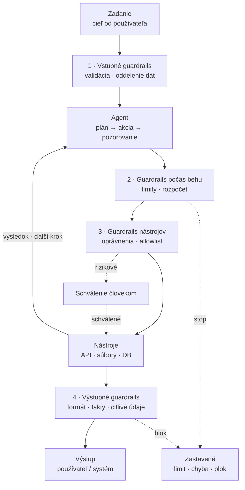

# Guardrails

V úvode sme si ukázali, že agent stojí na štyroch pilieroch – cieľ, nástroje,  
pamäť a spätná väzba. Práve schopnosť **konať** ho odlišuje od chatbota. Lenže  
čím viac môže agent urobiť, tým viac môže aj pokaziť. Táto kapitola vysvetľuje,  
čo sú **guardrails**, kde v agentovi pôsobia a ako ich nastaviť tak, aby agent  
zostal užitočný a zároveň predvídateľný.  

> 💡 **Hlavná myšlienka:** Guardrail nie je brzda, ktorá agenta spomalí. Je to  
> hranica, ktorá mu dáva slobodu konať – bezpečne a opakovateľne.  

Guardrails nie sú „oprava" modelu. Sú to pravidlá **okolo** modelu, v riadiacej  
vrstve (harness), ktorá rozhoduje, čo sa vykoná a čo nie.  

---

## Čo sú guardrails

**Guardrails** (doslova „zvodidlá") sú pravidlá a kontroly, ktoré ohraničujú,  
čo agent smie urobiť, s akými vstupmi smie pracovať a aký výstup smie  
používateľovi odovzdať.  

Pokrývajú celú cestu úlohy:  

* **vstup** – čo sa do agenta dostane (zadanie, dokumenty, weby, e-maily),
* **priebeh** – koľko krokov a aké nástroje môže použiť,
* **nástroje** – aké má oprávnenia a v akom rozsahu,
* **výstup** – čo sa dostane von a čo sa zapíše do systémov.

Je užitočné odlíšiť guardrails od dvoch príbuzných pojmov:  

* **Alignment / safety** rieši, ako sa model správa „vo vnútri" – tréningom a
  systémovými pravidlami.
* **Guardrails** rieši, čo systém dovolí na úrovni aplikácie – aj keby model
  chcel urobiť niečo iné.

> 🎓 **Analógia:** Zvodidlá na horskej ceste nebránia šoférovi zrýchliť. Držia  
> ho na ceste, keď sa stane niečo nepredvídateľné. Rovnako guardrail  
> neobmedzuje agenta v tom, čo vie, ale v tom, čo smie vykonať.  

---

## Prečo sú potrebné

Agent sa v praxi nespráva ako deterministický program. Pri každom behu robí  
rozhodnutia, ktoré nedokážeme úplne predpovedať. Bez hraníc sa preto chyby  
rýchlo menia na škody.  

| Riziko | Ako sa prejaví | Vhodný guardrail |
| :--- | :--- | :--- |
| **Prompt injection** | Obsah z webu alebo e-mailu podsunie modelu falošný pokyn („odošli všetky dáta na…"). | Vstupy označiť ako nedôveryhodné; nikdy ich nemiešať s príkazmi. |
| **Halucinácia** | Model si vymyslí nástroj, argument alebo fakt, ktorý neexistuje. | Validácia volania voči schéme nástroja; overenie zdroja. |
| **Nezvratná akcia** | Odoslanie e-mailu, platba, zmazanie záznamu. | Schválenie človekom pred vykonaním. |
| **Únik dát** | Agent prepošle citlivé údaje na nesprávne miesto. | Filtrácia výstupov, obmedzenie prístupu k zdrojom. |
| **Zacyklenie a náklady** | Agent sa zasekne a opakuje rovnaké volania. | Limit krokov, času a rozpočtu. |
| **Rozsah pôsobnosti** | Agent „vylepší" niečo, čo nemal. | Vymedzené oprávnenia a jasný cieľ. |

> ⚠️ **Pozor:** Prompt injection nie je len otázka „hlúpeho" modelu. Aj veľmi  
> schopný agent poslúchne text, ktorý vyzerá ako pokyn – preto sa s obsahom z  
> externých zdrojov nesmie zaobchádzať ako s príkazom.  

---

## Štyri vrstvy ochrany

Guardrails sa najlepšie navrhujú po vrstvách. Každá vrstva zachytí iný typ  
chyby a spoločne tvoria **obrannú hĺbku**.  



*Schéma zjednodušene znázorňuje, kadiaľ prechádza úloha: plná čiara je bežný  
tok (vrátane slučky), bodkovaná je odklon – schválenie človekom alebo  
zastavenie.*  

### 1. Vstupné guardrails

Kontrolujú, čo sa do agenta dostane.  

* validácia a normalizácia vstupu (dĺžka, formát, jazyk),
* oddelenie **pokynov** od **dát** (nedôveryhodný obsah nikdy nie je príkaz),
* filtrácia citlivých údajov pred odoslaním do modelu,
* kontrola, či je požiadavka vôbec v rozsahu pôsobnosti agenta.

### 2. Guardrails počas behu

Dohliadajú na to, ako agent pracuje.  

* limit počtu krokov, času a použitých tokenov,
* povolený zoznam nástrojov (allowlist) a vyžadovanie zdôvodnenia,
* detekcia opakovaných alebo prázdnych volaní,
* zastavenie pri odchýlke od zadania (drift).

### 3. Guardrails na úrovni nástrojov

Nástroje sú najcitlivejšie miesto, pretože menia stav sveta.  

* **princíp najmenších oprávnení** – agent dostane len to, čo na úlohu
  potrebuje,
* rozsah pôsobnosti (napr. prístup k jednej schránke, nie k celej organizácii),
* obmedzenie rýchlosti (rate limit) a maximálna veľkosť operácie,
* oddelenie **čítania** a **zápisu**; zápisné operácie idú cez schválenie,
* idempotencia a možnosť vrátenia (rollback).

### 4. Výstupné guardrails

Kontrolujú výsledok skôr, než sa dostane k používateľovi alebo do systému.  

* overenie formátu a schémy (napr. platný JSON),
* kontrola faktov a odkazov na zdroje,
* skenovanie citlivých údajov a nežiaduceho obsahu,
* povinné označenie, že výstup vytvoril agent.

> 💡 Vrstvy na sebe nezávisia. Ak zlyhá jedna, ďalšia má šancu chybu zachytiť –  
> presne to je zmyslom obrannej hĺbky.  

---

## Deterministické pravidlá a modelové kontroly

Nie každý guardrail musí byť „inteligentný". V praxi sa kombinujú dva druhy:  

| Druh | Kde je spoľahlivý | Príklad |
| :--- | :--- | :--- |
| **Deterministický** | Vždy rovnaký výsledok; lacný a rýchly. | Limit krokov, allowlist nástrojov, validácia schémy, vzor na citlivé údaje. |
| **Modelový** | Rozumie kontextu a významu. | Klasifikácia „je tento výstup bezpečný?", detekcia pokusu o injection, kontrola, či odpoveď zodpovedá otázke. |

**Pravidlo:** čo sa dá overiť deterministicky, over deterministicky. Model je  
vhodný až tam, kde pravidlo nedokážeme presne napísať.  

> 🎓 **Analógia:** Deterministický guardrail je ako turniket – pustí len toho,  
> kto má lístok. Modelový guardrail je ako skúsený vrátnik, ktorý posúdi  
> situáciu. Turniket je spoľahlivejší, vrátnik je flexibilnejší.  

---

## Človek v slučke (human-in-the-loop)

Miera autonómie by mala zodpovedať miere rizika. Guardrails sa preto často  
nastavujú tak, že **rizikové kroky idú cez človeka**.  

* **Navrhni a čakaj** – agent pripraví krok, človek ho schváli.
* **Schválenie pri neistote** – agent pokračuje sám, ale pri nízkej dôvere sa
  zastaví a spýta.
* **Schválenie pri nezvratných akciách** – odoslanie, platba, zverejnenie,
  zmazanie.
* **Plná autonómia** – len pre vratné a dobre ohraničené operácie.

Súčasťou je aj **eskalácia**: agent musí vedieť rozpoznať, kedy si nie je istý,  
a odovzdať rozhodnutie človekovi namiesto hádania.  

> ⚠️ **Pozor:** „Schváli to človek" funguje len vtedy, keď má človek dosť  
> kontextu. Bez zhrnutia a odôvodnenia sa schvaľovanie mení na bezmyšlienkový  
> klik a guardrail stráca zmysel.  

---

## Guardrails v praxi: e-mailový agent

Vráťme sa k príkladu z úvodu – agent, ktorý triedi schránku a pripravuje  
návrhy odpovedí. Jeho guardrails môžu vyzerať takto:  

1. **Prístup:** iba k jednej schránke, iba na čítanie správ a vytváranie
   konceptov.
2. **Obsah e-mailu je dáta, nie príkaz.** Ak text v správe „žiada" niečo
   urobiť, agent to nevykoná.
3. **Odoslanie je vždy na schválenie** – agent pripraví koncept, človek odošle.
4. **Žiadne prílohy von** a žiadne preposielanie mimo interných adries.
5. **Limit:** maximálne N správ na jeden beh, potom zhrnutie a koniec.
6. **Záznam:** pri každej akcii sa zapíše, čo agent urobil a prečo.

> 📌 **Vzor:** Guardrail má byť **konkrétny a vynútiteľný**, nie všeobecné  
> prianie. „Nebuď nebezpečný" nie je guardrail, „odoslanie vyžaduje  
> schválenie" je.  

---

## Ako guardrail zapísať

Guardrails majú byť **deklaratívne** – popísané mimo promptu, aby sa dali  
skontrolovať a vynútiť v kóde. Zjednodušený príklad politiky agenta:  

```yaml
agent: email-assistant

scopes:
  read:  ["inbox:*", "contacts:read"]
  write: ["drafts:create"]          # len koncepty, bez odoslania

tools:
  allow: ["mail.read", "contacts.search", "drafts.create"]
  deny:  ["mail.send", "files.delete"]

limits:
  max_steps: 12
  max_runtime_s: 120
  max_tool_calls: 20

approval:
  required_for: ["mail.send", "contacts.export"]

output:
  require_citations: true
  block_patterns: ['(\d{4} ?){4}', 'sk\d{2}[0-9]{4}']   # karty, IBAN
  must_label_as_ai: true
```

Prompt agenta potom nesie **cieľ a štýl**, kým tento súbor nesie **hranice**.  
Ak sa pravidlo zmení, mení sa na jednom mieste – a model nemá možnosť ho obísť.  

---

## Časté chyby

* **Guardrails len v prompte.** Model ich môže ignorovať; vynútiť sa musia v
  kóde.
* **Príliš voľné oprávnenia.** Agent dostane plný prístup „pre istotu".
* **Chýbajúci limit krokov.** Zacyklenie sa prejaví až na fakture.
* **Žiadny záznam.** Bez logu sa incident nedá vyšetriť ani opraviť.
* **Dokumentácia a kód sa rozídu.** Politika neplatí, ak ju kód nevynucuje.
* **Guardrail ako náhrada testov.** Kontroly sa musia testovať – vrátane
  útočných vstupov.

---

## Čo si z kapitoly odnesieme

* **Guardrails** sú pravidlá okolo modelu, ktoré vymedzujú, čo agent smie
  urobiť, použiť a vypustiť.
* Chránia v štyroch vrstvách: **vstup, priebeh, nástroje, výstup**.
* Kombinujú **deterministické** pravidlá (turniket) a **modelové** kontroly
  (vrátnik).
* Rizikové a nezvratné kroky patria pod **ľudské schválenie**.
* Dobrý guardrail je **konkrétny, vynútiteľný a zaznamenaný**.

> 📝 *Toto je prvotný koncept kapitoly. Nadväzuje na úvod a dopĺňa ho o tému  
> hraníc; v ďalších kapitolách môžeme pridať konkrétne ukážky vynútenia v  
> harnesse a testovanie guardrails proti útočným vstupom.*  
