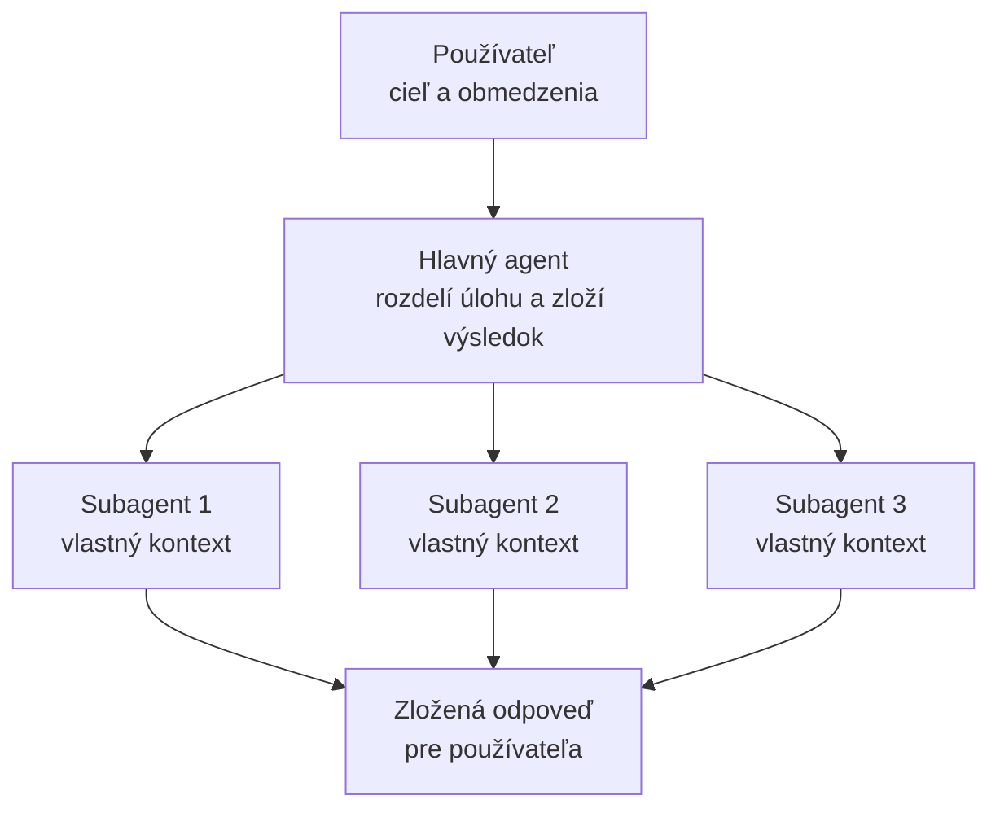

# Subagenti vo VS Code

V úvode sme ako jeden z typov agentov spomenuli **multi-agentný** systém:  
orchestrátor rozdelí úlohu a viac agentov s vymedzenými rolami ju rieši  
paralelne. V kapitole o agentoch vo VS Code sme videli rolu **Agent**, ktorá  
úlohu vykoná od zadania po overenie. Teraz sa pozrieme na to, ako tú istú  
myšlienku využíva samotný editor: **hlavný agent môže delegovať prácu ďalším  
agentom – subagentom.**  

> 💡 **Hlavná myšlienka:** Subagent je spôsob, ako nechať **jeho** pracovať vo  
> **vlastnom kontexte** a vrátiť do hlavnej konverzácie len **výsledok**. Hlavný  
> kontext tak zostane malý a prehľadný, aj keď popri úlohe prebehlo veľa  
> hľadania a čítania.  

---

## Čo je subagent

**Subagent** je agent, ktorého spustí iný agent (hlavný agent, orchestrátor), aby  
vyriešil **jednu ohraničenú podúlohu** – napríklad preskúmal časť kódu, porovnal  
dva postupy alebo skontroloval zmenu – a **vrátil výsledok** späť.  

Subagenti nie sú len „ďalší chat". Majú tri vlastnosti, ktoré z nich robia  
užitočný nástroj:  

| Vlastnosť | Čo znamená | Prečo je dôležitá |
| :--- | :--- | :--- |
| **Izolácia kontextu** | Každý subagent pracuje vo **vlastnom kontexte**. | Medzikroky (čítanie súborov, hľadanie na webe) sa nehromadia v hlavnej konverzácii. |
| **Paralelné vykonanie** | Nezávislé podúlohy môžu bežať **súčasne**. | Tri výskumy naraz sú rýchlejšie ako tri za sebou. |
| **Sústredený výsledok** | Hlavný agent dostane **zhrnutie**, nie celú históriu. | Hlavný kontext zostane malý a relevantný. |



*Hlavný agent pošle každému subagentovi zadanie a z ich výsledkov zloží odpoveď.  
Medzikroky zostávajú v kontextoch subagentov, nie v hlavnej konverzácii.*  

> 🎓 **Analógia:** Hlavný agent je vedúci projektu. Subagent je špecialista,  
> ktorému zadá jednu otázku. Špecialista sa v téme „ponorí", preberie veľa  
> materiálu a vedúcemu prinesie **jednu stranu zhrnutia** – nie celý priečinok s  
> poznámkami.  

> ⚠️ **Pozor na náklady:** Subagenti robia **vlastné volania modelu**. Menší  
> hlavný kontext preto neznamená automaticky nižšiu spotrebu tokenov alebo  
> nižšiu cenu. Delegovanie prináša réžiu na koordináciu – oplatí sa, keď je  
> podúloha jasne ohraničená.  

---

## Kedy delegovať a kedy nie

Subagent je zásah do toku úlohy. Vyplatí sa vtedy, keď má podúloha **jasný  
rozsah a výsledok**, ktorý hlavný agent ďalej použije.  

| Použite subagenta | Rovno zadajte hlavnému agentovi |
| :--- | :--- |
| **Výskum pred implementáciou** – nájdi súbory, vzory, možnosti. | Rýchle vyhľadanie alebo malá úprava. |
| **Porovnanie postupov** – over viac nezávislých riešení (aj rôznymi modelmi). | Úloha, kde sú kroky na sebe závislé a nedajú sa rozdeliť. |
| **Kontrola** – posúď oddelené hľadiská (správnosť, výkon) a spoj závery. | Práca, ktorá potrebuje **celý** kontext konverzácie. |

> 📌 **Pravidlo:** Ak by medzivýsledky zbytočne zaplnili hlavný kontext,  
> delegujte. Ak ide o drobnosť alebo na sebe kroky závisia, delegovanie viac  
> stojí, než prinesie.  

---

## Subagenti v chate cez `#runSubagent`

V Lokálnom harnesse (Local) beží delegovanie cez nástroj **Run Subagent** s  
identifikátorom `agent/runSubagent`. V chate ho môžete vyvolať **priamo**  
zápisom `#runSubagent` – symbol `#` vkladá do promptu odkaz na nástroj.  

Typický prompt vyzerá takto:  

```text
#runSubagent use https://finance.yahoo.com/ to get current price of
Apple, NVidia and MS with three subagents
```

Čo sa tým zadáva:  

* `#runSubagent` **vynúti** použitie nástroja na delegovanie (hlavný agent nemusí
  „hádať", že má delegovať),
* zvyšok vety je **zadanie** – z akého zdroja a čo získať,
* „with three subagents" určuje, že majú vzniknúť **tri** paralelné podúlohy
  (jedna pre Apple, jedna pre NVidia, jedna pre MS).

### Ako delegovanie prebieha

Delegovanie môžete vyžiadať **prirodzeným jazykom** alebo zápisom `#runSubagent`.  
Hlavný agent **môže delegovať aj sám**, bez vašej explicitnej požiadavky, ak  
usúdi, že sa to vyplatí.  

Hlavný agent pošle subagentovi zadanie, **prijme výsledok** a pokračuje s ním v  
práci. V Lokálnom harnesse má subagent vlastný kontext a **nededí históriu  
hlavnej konverzácie**.  

> ⚠️ **Preto musí byť zadanie sebestačné.** Lokálny subagent nevidí, čo ste si  
> predtým písali. Do zadania patrí:  

* **Cieľ** – akú otázku má zodpovedať alebo čo má dokončiť.
* **Kontext** – relevantné súbory, obmedzenia a rozhodnutia, ktoré už padli.
* **Povolené akcie** – smie iba skúmať, alebo aj meniť?
* **Očakávaný výsledok** – čo má vrátiť (zistenia, odporúčanie, zmeny).

> 📌 **Každé vyvolanie je jednorazové (stateless).** Hlavný agent **nemôže**  
> poslať subagentovi doplňujúcu otázku do tej istej „relácie". Ďalšia práca  
> znamená **nové** vyvolanie s príslušným kontextom. Nástroje na kladenie  
> doplňujúcich otázok a správu zoznamu úloh nemajú lokálni subagenti k  
> dispozícii.  

### Čo uvidíte v chate

* **Chat view:** bežiaci subagent sa zobrazí ako **zbalené volanie nástroja** s
  menom agenta a aktuálnou činnosťou (čítanie súborov, hľadanie v kóde).
  Kliknutím naň otvoríte prompt, volania nástrojov a vrátený výsledok.
* **Agents window:** subagenti sa zobrazujú ako **read-only chaty** v rámci
  session. Otvoríte ich cez indikátor v rodičovskom chate (zobrazí model,
  uplynulý čas a aktívne volanie nástroja).

Predvolene chat použije bohatšie zobrazenie, ktoré každého subagenta otvára v  
samostatnom editore. Vypnutím `chat.subagents.useRichRendering` zobrazíte  
aktivitu subagenta **inline** v rodičovskom chate.  

---

## Schvaľovanie: keď subagenti siahajú na web

Demo s Yahoo Finance má jeden háčik, ktorý si pri vyučovaní treba pripraviť  
vopred: **nástroj na načítanie webu vyžaduje schválenie** a pri **každej** URL  
sa VS Code pýta **dvakrát** – raz na schválenie **požiadavky** a raz na  
schválenie **odpovede**, ktorá sa vráti do chatu.  

Pri troch subagentoch, ktoré načítavajú rovnakú doménu, to znamená **šesť  
dialógov**. Dajú sa vypnúť tromi spôsobmi – od najbezpečnejšieho po najmenej  
bezpečný.  

### 1. „Always allow" v dialógu (najjednoduchšie)

V každom dialógu môžete schváliť **jednorazovo**, alebo **automaticky povoliť  
budúce** požiadavky či odpovede pre danú URL alebo doménu. Ak v oboch dialógoch  
zvolíte **doménu**, traja subagenti sa už na tú istú doménu nepýtajú.  

### 2. Predschválenie domény v nastaveniach

Otvoríte **Settings (JSON)** a pridáte:  

```json
"chat.tools.urls.autoApprove": {
    "https://finance.yahoo.com/*": {
        "approveRequest": true,
        "approveResponse": true
    }
}
```

Nastavenie prijíma **presné URL, glob vzory aj wildcardy**. Pre kurz je to  
odporúčaná voľba: študenti spustia demo bez prerušovania a vyňaté sú len  
vymenované stránky.  

### 3. Vypnutie schvaľovania pre všetko

Permission picker v chate má úroveň **auto-approve all tools**. Za predvolené ju  
nastavíte cez `chat.permissions.default`, prípadne `chat.tools.global.autoApprove`  
(platí pre všetky workspaces).  

> ⚠️ **Toto pre vyučovanie neodporúčam.** Webové stránky môžu obsahovať **skryté  
> pokyny** namierené na AI (prompt injection). Pri plne automatickom schvaľovaní  
> nič nebráni agentovi, aby podľa nich konal – vrátane spúšťania príkazov alebo  
> úprav súborov. Presne tu sa napája kapitola o guardrails.  

> 📌 **Ak je nastavenie sivé alebo ignorované**, spravuje ho organizácia –  
> `chat.tools.eligibleForAutoApproval` sa dá nastaviť na úrovni organizácie.  

> 💡 **Poznámka k demu:** Yahoo Finance načítava veľkú časť obsahu cez  
> JavaScript, takže nástroj na načítanie webu môže vrátiť **neúplné alebo  
> oneskorené** ceny. Ak čísla nesedia, skúste jednoduchšiu stránku – a študentom  
> pripomeňte, že agent je len taký dobrý, ako to, čo dokáže prečítať.  

---

## Customizovaní subagenti

V Lokálnom harnesse subagent **dedí** inštrukcie a vybrané nástroje hlavného  
agenta – pokiaľ neurčíte **custom agent**. Custom agent je `.agent.md` súbor,  
ktorý dá subagentovi **vlastné inštrukcie** a môže prepísať **nástroje** aj  
**model**. (Custom agentom sa podrobne venuje kapitola o customizácii.)  

Takýto agent nemusí byť viditeľný v pickri – môže existovať **len ako pomocník  
pre delegovanie**. Vytvorte `.github/agents/codebase-researcher.agent.md`:  

```markdown
---
name: Codebase Researcher
description: Find relevant code and explain existing patterns
user-invocable: false
tools: ['read', 'search']
---
Research the requested topic without changing files.
Return relevant file paths, existing patterns, and unanswered questions.
```

Po uložení ho z hlavného chatu vyžiadate menom:  

```text
Use the Codebase Researcher subagent to explain how authentication works
in this project.
```

> ⚠️ **Mená agentov sú citlivé na veľkosť písmen.** Použite presne to meno, aké  
> je v definícii.  

### Dve páčky, ktoré riadia dostupnosť

| Prepínač | Predvolene | Čo robí |
| :--- | :--- | :--- |
| `user-invocable` | `true` | Riadiace zobrazenie v **pickri agentov**. Nastavte `false` a agent bude **len** ako subagent (napr. Codebase Researcher). |
| `disable-model-invocation` | `false` | Bráni tomu, aby tohto agenta **vyvolal iný agent** ako subagenta. |

> 📌 `user-invocable` a `disable-model-invocation` sú **oddelené** ovládacie  
> prvky. Skrytie z pickra (prvý) nie je to isté ako zákaz delegovania (druhý).  
> Staršia vlastnosť `infer` je nahradená týmito dvoma.  

### Obmedzenie, ktorých subagentov smie koordinátor použiť

Ak chcete, aby sa koordinátor sústredil na **konkrétnych** pomocníkov, nastavte  
mu v hlavičke `agents`:  

* `agents: ['Codebase Researcher', 'Reviewer']` – povolí **len** vymenovaných
  agentov.
* `agents: ['*']` alebo vynechanie vlastnosti – povolí **všetkých** dostupných.
* `agents: []` – **zabráni** použitiu subagentov.

> ⚠️ **Pozor:** Ak agenta explicitne vymenujete v `agents`, **prebije** to jeho  
> `disable-model-invocation: true`. Viditeľnosť v pickri a dostupnosť ako  
> subagent sú dve rôzne veci.  

Do `tools` koordinátora nezabudnite pridať **tool set** `agent` – bez neho nemá  
čím delegovať.  

---

## Ako subagent volí model

Lokálny subagent vyberá model v tomto poradí:  

1. **Explicitný model** od hlavného agenta vo volaní nástroja `runSubagent`.
2. **Model custom agenta** (`model` v hlavičke – jedno meno alebo prioritizovaný
   zoznam).
3. **Auto**, ak je zapnuté `chat.subagents.defaultToAuto` a platia jeho
   podmienky.
4. **Model hlavnej konverzácie.**

Model viete vyžiadať priamo v prompte (doplňte meno modelu dostupného v danej  
session):  

```text
Use a subagent with <model name> to review the error handling in this module.
```

> ⚠️ Explicitné aj agentom nastavené modely sa porovnávajú s **cenovou  
> hladinou** hlavného modelu. Ak ju prekročia, subagent sa **nespustí** a  
> oznámi, ktoré modely sú dostupné.  

> 💡 Napojenia na **vlastný kľúč (BYOK)** používajú ďalej ten istý model, pokiaľ  
> neurčíte iný. Auto routing cez `chat.subagents.defaultToAuto` nie je  
> obmedzený pevnou cenovou hladinou hlavného modelu.  

---

## Orchestration patterns: koordinátor a robotníci

Robustný opakovateľný postup je **coordinator and worker**: koordinátor deleguje  
výskum a kontrolu a **sám** robí zmeny v kóde. Ukážka používa tri súbory agentov  
– už spomenutý `Codebase Researcher`, ďalej recenzent a koordinátor.  

`.github/agents/reviewer.agent.md`:  

```markdown
---
name: Reviewer
description: Review changes for correctness and missing tests
user-invocable: false
tools: ['read', 'search']
---
Review the supplied files and change summary without editing files.
Report correctness issues and missing test coverage with file references.
```

`.github/agents/feature-builder.agent.md`:  

```markdown
---
name: Feature Builder
description: Implement features with delegated research and review
tools: ['agent', 'edit', 'read', 'search']
agents: ['Codebase Researcher', 'Reviewer']
---
For each feature request:
1. Ask Codebase Researcher to find relevant files and existing patterns.
2. Use its findings to implement the requested change.
3. Ask Reviewer to check the changed files, passing the requirements
   and a summary of your changes.
4. Address the findings, then summarize the changes and remaining risks.
```

Robotníci majú **read-only** nástroje, koordinátor má nástroje na **úpravu**. Ak  
treba ďalšiu kontrolu, koordinátor spustí **nové** vyvolanie s aktualizovaným  
kontextom – pôvodné vyvolanie si totiž konverzáciu na doplňujúce otázky nedrží.  

### Kontrola z viacerých hľadísk (bez nových súborov)

Na jednorazovú kontrolu stačí rozdeliť hľadiská priamo v prompte:  

```text
Use two subagents to review the current changes without editing files.
Ask one to check correctness and the other to check test coverage.
Combine their findings, remove duplicates, and prioritize actionable issues.
```

> ⚠️ Oddelené kontexty odhalia **rôzne** veci, ale **nezaručujú** nezaujaté ani  
> správne závery. Spojené zistenia si pred konaním prejdite.  

---

## Vnorení subagenti

Lokálny subagent **predvolene nemôže** delegovať ďalej. Pre rekurzívny postup  
zapnite `chat.subagents.allowInvocationsFromSubagents` (predvolene `false`).  
Vnorovanie je obmedzené na **maximálnu hĺbku 5**.  

Rekurzívny agent sa vytvorí tak, že sa **seba samého** uvedie v `agents`.  
Napríklad na rozdelenie zoznamu súborov na menšie výskumné úlohy:  

```markdown
---
name: Recursive Processor
description: Research independent files in small groups
tools: ['agent', 'read', 'search']
agents: ['Recursive Processor']
argument-hint: A list of files to summarize
---
Summarize the purpose of each file without changing it.
* For more than four files, split the list in half and delegate each half
  to a Recursive Processor subagent.
* For four or fewer files, or if further delegation is unavailable,
  summarize the files directly.
* Combine the results into a single summary.
```

> ⚠️ **Rekurzívne úlohy držte ohraničené** a vždy uveďte **podmienku  
> zastavenia** – inak hrozí, že agenti budú donekonečna delegovať to isté.  

---

## Praktická ukážka: ceny akcií cez tri subagentov

Spojme všetko do jedného priebehu.  

1. Otvorte projekt a v **Chat view** spustite session s **Lokálnym** harnessom a
   rolou **Agent**.
2. Cez **Configure Tools** sa uistite, že je zapnutý **Run Subagent
   (`agent/runSubagent`)**.
3. Pripravte **schválenie domény** (`chat.tools.urls.autoApprove` pre
   `https://finance.yahoo.com/*`) – inak vás bude čakať šesť dialógov.
4. Zadajte prompt:

```text
#runSubagent use https://finance.yahoo.com/ to get current price of
Apple, NVidia and MS with three subagents
```

5. Sledujte **tri** bežiace subagenty (zbalené volania nástrojov) a nakoniec
   zhrnutie hlavného agenta s cenami.

> 🎓 **Čo sa tým študenti naučia:** hlavný agent vie **rozložiť** úlohu,  
> **vyparalelizovať** tri nezávislé čítania a z ich výsledkov **zložiť** jednu  
> odpoveď – a to bez toho, aby sa celý priebeh hromadil v hlavnom kontexte.  

---

## Riešenie problémov

| Príznak | Pravdepodobná príčina / riešenie |
| :--- | :--- |
| Hlavný agent nedeleguje. | Overte, že je v **Configure Tools** zapnutý **Run Subagent**, a vyžiadajte subagenta **explicitným** zadaním s jasnou úlohou. |
| Custom agent nie je dostupný. | Skontrolujte presné (case-sensitive) meno, `disable-model-invocation` a zoznam `agents` koordinátora. `user-invocable: false` ho iba skrýva z pickra. |
| Požadovaný model sa nespustí. | Použite niektorý z modelov uvedených v chybe, alebo explicitnú voľbu odstráňte. |
| Subagent nemôže delegovať ďalej. | Skontrolujte nastavenie vnorených subagentov, limit hĺbky a či má v `tools` uvedený `agent`. |

---

## Čo si z kapitoly odnesieme

* **Subagent** je agent, ktorému hlavný agent deleguje jednu ohraničenú podúlohu
  a prevezme len jej výsledok.
* Vďaka **izolácii kontextu, paralelnosti a sústredeným výsledkom** zostáva
  hlavná konverzácia malá a prehľadná.
* V Lokálnom harnesse delegovanie vyvoláte cez `#runSubagent`; zadanie musí byť
  **sebestačné** a každé vyvolanie je **jednorazové**.
* **Custom agent** (`.agent.md`) dá subagentovi vlastné inštrukcie, nástroje a
  model; `user-invocable` a `disable-model-invocation` riadia jeho dostupnosť
  oddelene.
* Koordinátor s `agents` a tool setom `agent` sa stáva **orchestrátorom**;
  vnorených subagentov treba zapnúť zvlášť (`chat.subagents.allowInvocationsFromSubagents`)
  a držať v ohraničenej hĺbke.
* Delegovanie šetrí kontext, ale **nie automaticky náklady** – a webové vstupy si
  strážte cez schválenie (guardrails).

> 📝 *Toto je prvotný koncept kapitoly. Nadväzuje na kapitolu o agentoch vo  
> VS Code a na guardrails; v ďalších kapitolách môžeme rozobrať customizáciu  
> `.agent.md` a handoffs podrobne a pridať ďalšie cvičenia s delegovaním.*
